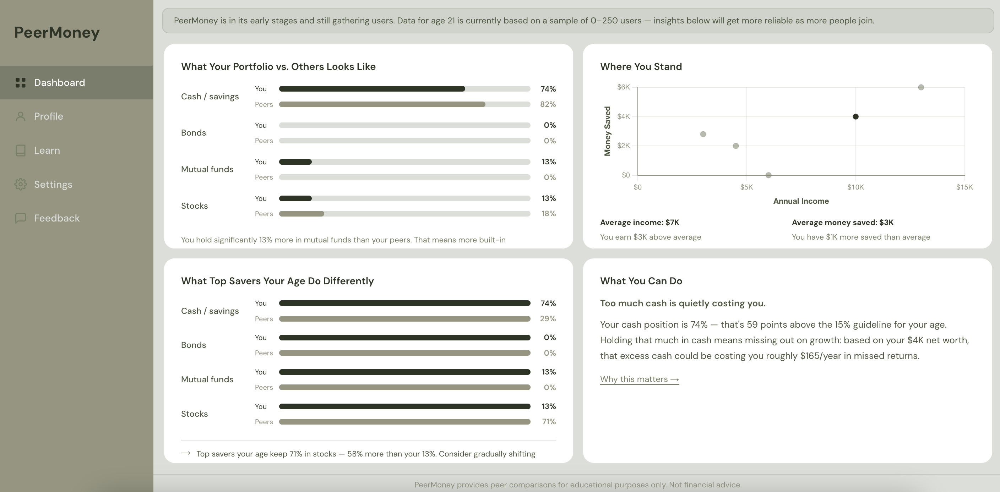

# PeerMoney

**[peermoney.app](https://peermoney.app)**

## Problem

Most people have no real way to tell if they're financially "on track" — generic advice like "save 20% of your income" doesn't account for age, income level, or what people actually similar to you are doing. Financial planning content is written for averages, not for you specifically, and there's no easy way to see how your actual portfolio and savings stack up against real peers.

PeerMoney solves this by benchmarking users against anonymized peers in their own age bracket, then translating the gap between "where you are" and "where established financial guidelines say you should be" into one clear, prioritized, dollar-quantified recommendation — not a wall of generic tips.

## Features

- **Auth & onboarding** — email/password signup with confirmation, login, password reset, and a guided onboarding flow that collects birthday (age is derived automatically, never re-entered), income, net worth, and portfolio allocation.
- **Peer benchmarking** — real-time peer matching by age bracket via a Postgres RPC and Supabase Realtime, so comparisons stay live as peer data changes. Includes sample-size transparency messaging when a cohort is still small.
- **Personalized insights engine** — a rules-based system that scores a user's allocation against financial guidelines and surfaces one prioritized, plain-language recommendation with dynamically computed figures (e.g. estimated annual cost of holding excess cash).
- **Data visualization** — an income-vs-net-worth scatter plot and portfolio allocation comparison bars built with Chart.js.
- **Profile & account management** — editable income/net worth/allocation, read-only derived age, and full account deletion.

## Tech stack

- **Framework**: Next.js (App Router), TypeScript, React
- **Backend**: Supabase — PostgreSQL, Auth, Row-Level Security, Realtime, RPC functions
- **Styling**: Tailwind CSS
- **Charts**: Chart.js / react-chartjs-2
- **Deployment**: Vercel
